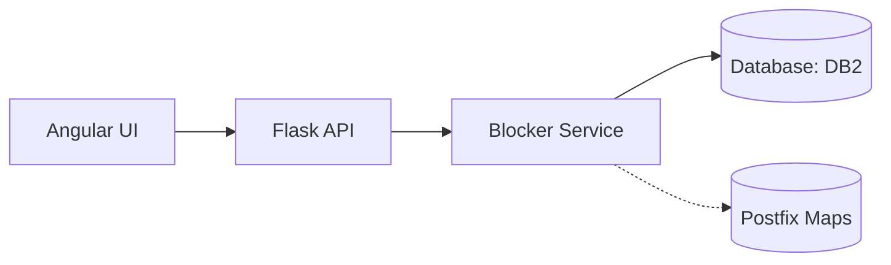

<!-- Updated to best practices on 2025-09-14. -->
# Architecture

<!-- BEGIN GENERATED: ARCH:MAIN -->

High-level component overview and data flow for {{PROJECT_NAME}}.

## Components

- Flask API (`postfix_blocker/api.py`): CRUD endpoints on `/addresses`.
- Blocker Service (`postfix_blocker/blocker.py`): Polls DB and writes Postfix maps.
- Frontend (`frontend/`): Angular app that calls the API.
- Database: `blocked_addresses` table.

## Data Model

`blocked_addresses(id, pattern, is_regex, updated_at)`

## Cross-Cutting Concerns

- AuthN/AuthZ: TODO
- Logging: Python `logging` and container logs via rsyslog
- Metrics: TODO
- Error Handling: API returns 503 until DB is ready

## Operations

- Scaling: API and blocker can scale horizontally; ensure DB connection limits
- Config: via environment (see [INSTALL](INSTALL.md))
- Deployment: Docker Compose for dev; TODO for production guidance

See also: [AGENTS](AGENTS.md), [TESTING](TESTING.md).

<!-- END GENERATED: ARCH:MAIN -->
